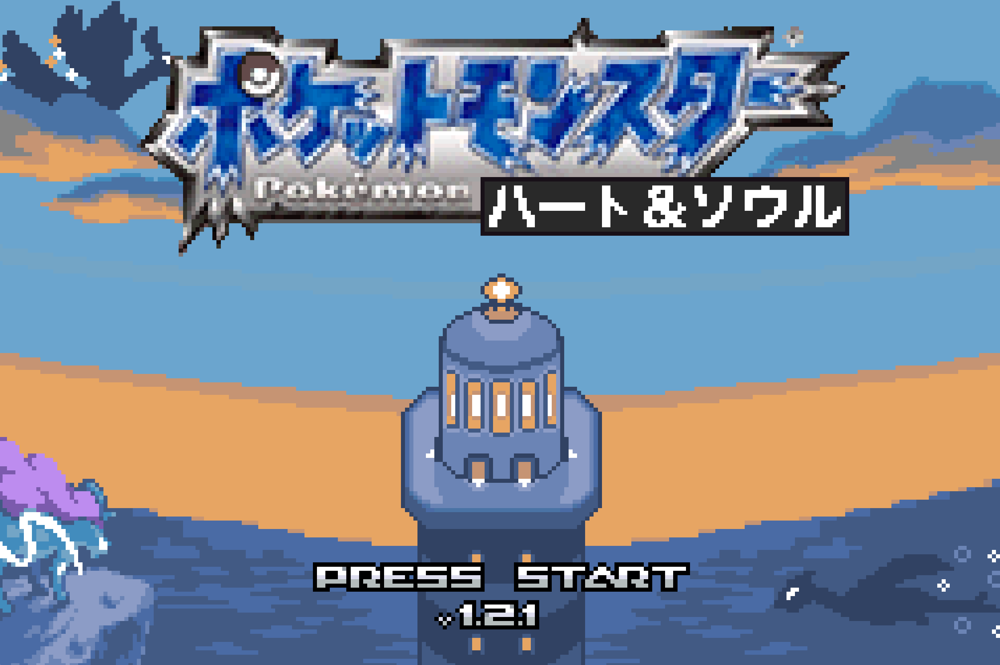

# Pokemon Heart & Soul - Japanese Localization

This is a Japanese localization fork of [Pokemon Heart & Soul](https://github.com/PokemonHnS-Development/pokemonHnS) v1.2.1 by Lil Dill and the HnS Development team.

The goal is to replace all English text with Japanese so the game plays like a native JP GBA Pokemon title.

Custom title screen based on the SoulSilver JP logo design, adapted to read "Heart & Soul" (ハート&ソウル).

## Status

~99% of player-visible text is translated. Build is clean and playable.

## What Was Done

### Font & Encoding
- Ported the full Japanese font and character encoding from `pret/pokeemerald-jp` (the official JP decomp of Pokemon Emerald)
- Added hiragana (bytes 0x01-0x50), fullwidth katakana (bytes 0x51-0xA0), and JP symbols to `charmap.txt`
- Copied JP font glyph images (`japanese_small.png`, `japanese_normal.png`) from pokeemerald-jp
- Set `GAME_LANGUAGE` to `LANGUAGE_JAPANESE` in `include/constants/global.h`
- All JP strings use the `{JPN}` control code prefix (0xFC 0x15) to switch the GBA renderer to the JP glyph table

### Data Tables (all .h files — 100%)
- Pokemon species names (430+) — from pokeemerald-jp + Bulbapedia for Gen 4+
- Move names and descriptions — from pokeemerald-jp
- Ability names and descriptions — from pokeemerald-jp + translated for HnS customs
- Item names and descriptions — from pokeemerald-jp + translated for HnS customs
- Nature names — from pokeemerald-jp
- Trainer class names — from pokeemerald-jp
- Pokedex entries and flavor text — from pokeemerald-jp
- Pokedex category names — from pokeemerald-jp
- Ribbon descriptions — translated
- Gift ribbon descriptions — translated
- Wonder Trade OT names — translated
- Follower Pokemon messages — translated
- Easy Chat voice group entries — translated
- Union Room text — translated
- In-game trade dialogue — translated

### NPC Dialogue (551 maps — 100%)
- All 551 map script files (`data/maps/*/scripts.inc`) translated — ~12,000 individual strings
- Johto maps matched against authentic HGSS JP ROM text where available (~61% match rate)
- Hoenn maps matched against JP Emerald ROM text
- HnS-original dialogue translated with Pokemon-appropriate tone
- Quality pass corrected ~156 wrong character names (e.g., Steven→Daigo, Brawly→Touki)
- Quality pass corrected ~23 wrong location names (e.g., Sootopolis→Rune City)
- Fixed hyphen-as-long-vowel errors in 16 files (e.g., ko-na- → corner)
- Fixed 15 garbled/romaji remnant strings in Johto maps

### UI / System Strings (`src/strings.c` — ~930 strings)
- Menu labels, save prompts, error messages, Pokemon Center dialogue
- Start menu items (Pokemon, Bag, Trainer Card, Save, Options, etc.)
- PC system text (deposit, withdraw, move, release)
- Mart clerk text, nurse dialogue, item obtain messages
- Pokedex rating text, surf prompts, repel prompts
- Save/load system messages
- Cable club and link battle text

### Battle Text (`src/battle_message.c` — fully translated)
- All battle message templates: super effective, fainted, stat changes, weather, abilities
- Fixed double `{JPN}` prefix garbling — battle_message.c strips redundant `{JPN}` from substituted Pokemon/move/ability names before insertion

### System Text Files (`data/text/*.inc` — 100%)
- `pkmn_center_nurse.inc` — Pokemon Center nurse dialogue
- `mart_clerk.inc` — shop clerk dialogue
- `obtain_item.inc` — item acquisition messages
- `pc.inc`, `pc_transfer.inc` — PC system messages
- `save.inc` — save system messages
- `pokedex_rating.inc` — Pokedex evaluation
- `trainers.inc` — trainer encounter/defeat/post-battle text
- `match_call.inc` — PokeNav Match Call messages (from JP Emerald ROM)
- `tv.inc` — TV broadcast scripts (from JP Emerald ROM)
- `apprentice.inc` — Battle Frontier apprentice dialogue (from JP Emerald ROM)
- `battle_dome.inc`, `battle_tent.inc` — Battle Frontier text
- `contest_strings.inc`, `contest_painting.inc`, `contest_link.inc` — contest system
- `berries.inc` — berry descriptions
- `birch_speech.inc` — Prof. Birch intro speech
- `cable_club.inc` — link cable system
- `move_tutors.inc` — move tutor dialogue
- `safari_zone.inc` — Safari Zone text
- `check_furniture.inc` — Secret Base furniture
- `lottery_corner.inc` — lottery system
- `shoal_cave.inc` — Shoal Cave NPC
- `frontier_brain.inc` — Frontier Brain dialogue
- `secret_base_trainers.inc` — Secret Base trainer text
- `pokemon_news.inc` — Pokemon News broadcasts
- `mauville_man.inc` — Mauville old man stories/poems
- `questionnaire.inc`, `event_ticket_1.inc`, `event_ticket_2.inc` — event/mystery gift
- `blend_master.inc`, `record_mix.inc` — berry blending/record mixing
- `abnormal_weather.inc`, `surf.inc` — field messages
- All `gift_*.inc` files (8 files) — distribution event text

### Script Text Files (`data/scripts/*.inc` — 100%)
- `field_move_scripts.inc` — HM/field move dialogue
- `day_care.inc` — Day Care system
- `repel.inc` — repel prompt system
- `follower.inc` — follower Pokemon interactions
- `berry_blender.inc` — berry blender minigame
- `berry_tree.inc` — berry tree interactions
- `bug_contest.inc` — Bug Catching Contest
- `contest_hall.inc` — contest hall dialogue
- `lilycove_lady.inc` — Lilycove special NPCs
- `mauville_man.inc` — Mauville old man scripts
- `secret_base.inc`, `shared_secret_base.inc` — Secret Base system
- `debug.inc` — debug menu text
- `change_deoxys_form.inc` — Deoxys form change
- `players_house.inc` — player's house dialogue
- `secret_power_tm.inc` — Secret Power TM
- `safari_zone.inc` — Safari Zone scripts
- `roulette.inc` — roulette minigame
- `profile_man.inc` — profile/trainer card
- All `gift_*.inc` files — event distribution scripts

### C Source Files (misc)
- `src/landmark.c` — 44 location names for map system
- `src/item_menu.c` — bag UI strings
- `src/berry_blender.c` — berry blender UI
- `src/map_name_popup.c` — map name display
- `src/scrcmd.c` — 7 in-game trade names
- `src/start_menu.c` — start menu text
- `src/main_menu.c` — title/continue screen
- `src/naming_screen.c` — full JP kana keyboard rewrite
- `src/text_input_strings.c` — keyboard display strings
- `src/options_plus_menu.c` — custom options menu (~102 strings)
- `src/tx_rac_menu.c` — randomizer/challenge settings (~275 strings)
- `src/tx_rac_viewer.c` — settings viewer (~118 strings)
- `src/pokenav_menu_handler_gfx.c` — PokeGear/PokeNav labels
- `src/trainer_card.c` — player name rendering fix
- `src/battle_records.c` — trainer name rendering fix
- `src/pokemon_summary_screen.c` — OT name and nickname rendering fixes
- `src/hall_of_fame.c` — Hall of Fame name rendering
- `src/menu.c` — save menu player name + start menu width fix
- `src/script_menu.c` — multichoice player name fix
- `src/debug.c` — debug menu text
- `src/mystery_gift_scripts.c` — mystery gift UI
- `src/mystery_event_msg.c` — mystery event messages
- `src/dodrio_berry_picking.c` — minigame text
- `src/match_call.c` — Match Call system
- `src/sound_check_menu.c` — sound test menu
- `src/international_string_util.c` — JP string width utilities
- `src/pokemon.c` — species name `{JPN}` prefix handling fix
- `src/daycare.c` — day care system text
- `src/evolution_scene.c` — evolution messages
- `src/party_menu.c` — party menu text
- `src/pokedex.c`, `src/pokedex_plus_hgss.c` — Pokedex UI
- `src/pokemon_summary_screen.c` — summary screen text
- `src/region_map.c` — region map display
- `src/title_screen.c` — title screen rendering
- `src/union_room_chat.c` — Union Room chat
- `src/ereader_helpers.c` — e-Reader text
- `src/berry.c` — berry system
- `src/event_object_movement.c` — follower system
- `src/follower_helper.c` — follower helper text
- `src/item_use.c` — item use messages

### Region Map
- All Johto map section names in `region_map_sections_johto.json`
- All Kanto map section names in `region_map_sections.json`
- All Hoenn map section names preserved
- Added `jp_name` field pattern to JSON + Inja template conditional so JP display names coexist with English C identifiers

### Naming Screen (full rewrite)
- Replaced English QWERTY keyboard with 3-page JP kana input system
- Page 1: Hiragana (かな) — 5x10 grid with dakuten/handakuten keys
- Page 2: Katakana (カナ) — matching layout
- Page 3: ABC/Symbols — Latin characters and numbers
- Dakuten/handakuten application via grid keys and L/R button cycling
- Page swap graphics: `page_swap_upper.png` (カナ), `page_swap_lower.png` (かな), `page_swap_others.png` (ABC)
- Cursor auto-skips blank cells in the kana grid

### Graphics
- `graphics/title_screen/pokemon_logo.png` — JP Pokemon logo
- `graphics/title_screen/emerald_version.png` — JP version text
- `graphics/title_screen/pokemon_logo.pal` — updated palette
- `graphics/naming_screen/page_swap_*.png` — kana/ABC page labels
- `graphics/types/*.png` — all 23 type icons with JP text (normal, fire, water, grass, electric, ice, fight, poison, ground, flying, psychic, bug, rock, ghost, dragon, dark, steel, mystery + 5 contest types)
- `graphics/pokedex/interface.png`, `menu.png`, `search_menu.png` — Pokedex UI
- `graphics/pokemon_storage/menu.png` — box system labels
- `graphics/pokeblock/menu.png` — Pokeblock selection
- `graphics/bag/menu.png` — bag pocket labels
- `graphics/contest/results_screen/tiles.png` — contest result labels
- `graphics/interface/status_icons.png` — status condition text

### Bug Fixes (localization-specific)
- **Species name truncation**: Fixed `SetBoxMonData` in `src/pokemon.c` stripping `{JPN}` prefix bytes
- **Battle text garbling**: Added `{JPN}` prefix stripping in `BattleStringExpandPlaceholders` to prevent double `{JPN}` when substituting names
- **Player name garbling**: Added manual `{JPN}` prepend in 8 locations where raw save data names are rendered (main_menu.c, strings.c, menu.c, script_menu.c, hall_of_fame.c, trainer_card.c, battle_records.c, pokemon_summary_screen.c)
- **ConvertInternationalString no-op**: Identified and worked around the fact that this function does nothing in JP mode — all callsites manually patched
- **Start menu width**: Increased from 7 to 9 tiles, shifted left from 22 to 20 to fit JP text
- **Options menu**: ON/OFF→あり/なし, region names→JP, generation labels→JP
- **PKMN glyph collision**: Replaced `{PKMN}` control code with `ポケモン` in JP strings (bytes 0x53/0x54 conflict with katakana ウ/エ)

### Validation Infrastructure
- `scripts/validate_charmap.py` — validates all string characters exist in GBA charmap
- `scripts/validate_control_codes.py` — ensures control codes aren't dropped during translation
- `scripts/validate_lengths.py` — checks name strings against max length constants
- Auto-validation hook runs charmap check after every file edit

### Translation Sources
All translations prioritized official sources:
1. **JP Emerald ROM** — official GBA text (primary source for Hoenn content)
2. **HGSS JP ROM** (HeartGold/SoulSilver) — official DS text for Johto content
3. **pokeemerald-jp** / **pokecrystal** decomps — official decomp text
4. **Manual translation** — only for HnS-custom content with no official equivalent

## Known Remaining Issues

### Playtest Bugs (minor — work in progress)
- Summary screen: move description area cut off (needs tilemap .bin edit)
- Bag: item description positioning needs verification
- Pokedex: description area whitespace
- Summary screen: JP tilemap labels may show blank tiles where EN labels were longer
- Several menu PNGs display incorrectly (bag, pokedex, storage, contest) — these are 4-bit/8-bit indexed PNG conversion issues being actively worked on

### Graphics Not Yet Localized (~70 files)
- Summary screen tilemap .bin files (page headers, effect/description labels)
- Pokedex HGSS tilemap .bin files (15+ screen layouts)
- `graphics/title_screen/press_start.png`
- `graphics/types/fairy.png`
- Party menu, storage, contest, naming screen tilemap .bin files

### Other
- Fairy type icon needs JP graphic
- TM compatibility display needs in-game testing
- ~300 debug/internal strings (not player-visible)

## Build

```bash
make modern -j$(nproc)          # Build
make clean && make modern -j4   # Clean rebuild
# Output: pokemonHnS.gba — test with mGBA
```

Requires devkitARM with GCC. Follow [pret's pokeemerald build guide](https://github.com/pret/pokeemerald/blob/master/INSTALL.md) but use `make modern`.

---

# Original README

*Everything below is from the original Pokemon Heart & Soul repository.*

---


# Pokemon Heart & Soul
Pokemon Heart & Soul brings the classic Johto Region and its iconic story to the world of modern GBA decomp hacking. Built on the Modern Emerald decomp, this project offers a fresh take on the GSC/HGSS experience, blending key aspects of the Gen 2 and Gen 4 games, while incorporating many modern QoL features, as well as some familiar Gen 3 mechanics. Not only is Heart & Soul (HnS) a first-of-its-kind, fully completed, playtested, and largely faithful GSC remake / HGSS demake, it's also completely open source, and is intended to be a base for a new generation of Johto rom hacks.


## Developer's Note:
Development for this project was primarily (95%) a solo-effort that consumed almost all of my free time for the last year. I am not a professional programmer, but I did my best to make the game that I wanted to play. If you'd like to improve, expand upon, or make your own version of HnS, feel free to take advantage of the open source! Please direct any questions to the [Heart & Soul Discord](https://discord.gg/KmuvXJrS9M). Also, the github link in the download section of this post is the ONLY place you will EVER find an official download of this project, and our devs do NOT accept donations. I hope you enjoy!

## About the game:
### Features
- Generation 1-3 Pokemon, plus their later gen evolutions (excluding the Regis and Jirachi)
- Full Johto story and Kanto postgame from HGSS, including the Kimono Girls and Eusine
- Following Pokemon
- Overworld background Pokemon allow you to easily see the notable encounters on each route
- Overworld background Pokemon in cities, towns, or areas with no encounters are just for the vibes
- Day/Night System with variable encounters
- Dynamic overworld palettes
- HGSS Music
- Highly varied trainer teams and encounters, based on Crystal Legacy
- HMs do not need to be taught to a Pokemon in order for it to be used
- Apricons replaced with berries, Kurt will use them to make unique Pokeballs
- Timekeeping does not track days of the week, Everything is progression based
- 16 Gym leader rematches
- Two Safari Zones
- Unique surfing Pokemon sprites
- Customizable shiny rate
- Physical/special split is toggleable
- Fairy type is toggleable
- AutoRun and FastSurf are toggleable
- Quick run from wild battles using button combination
- Ball prompts for quick catching
- ... and much more!

For full details on features, differences from GSC/HGSS, and credits, see the [original repository](https://github.com/PokemonHnS-Development/pokemonHnS).
